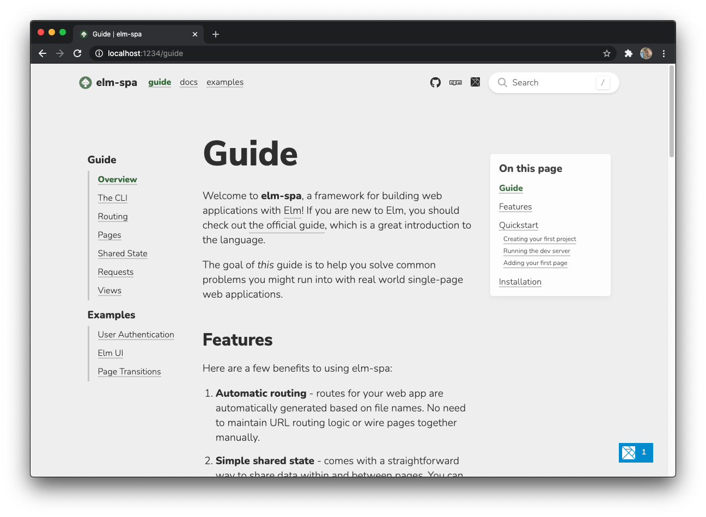

# elm-spa.dev
> 🌳  built with [elm-spa](https://elm-spa.dev)



## dependencies

This project requires the latest LTS version of [Node.js](https://nodejs.org/)

```bash
npm install -g elm-spa
```

## running locally

```bash
elm-spa server  # starts this app at http:/localhost:1234
```

### other commands

```bash
elm-spa add    # add a new page to the application
elm-spa build  # one-time production build
elm-spa watch  # builds code as you go (without the server)
```

## learn more

You can learn more at [elm-spa.dev](https://elm-spa.dev)

